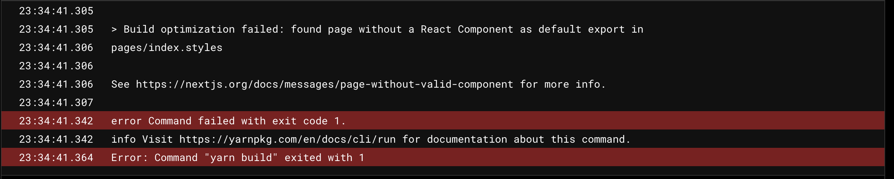

My Tech Notes blog is built using Next.js and Tailwindcss. While building out my blog pages, I noticed the list of tailwind classes grew exponentially. I did what any other developer would do, refactor and make the component leaner. What I learned was that Next.Js has opinions on where you put your code to better optimize the build.


## Separation of Concerns
I don't want components and styles to live in the same file. I prefer storing style objects in a separate file.

##### Example:
```bash
- pages
    - index.tsx
    - index.styles.ts
```

By separating the two files I can easily find styles for a specific component. We can import the styles object and apply the classes to HTML elements.

```javascript
import postStyles from './post.styles'

const Home = () => {
    return (
        <section className={postStyles.container}>
            <p>Some Text here</p>
        </section>
    )
}

export default Home
```

## Build Optimization Failed
After moving all component styles to their own file and testing locally, I decided to push my code to production. I was surprised to find the following error.



Next.Js did not like the fact that I had a `.ts` file not returning a React Component. The built-in [routing](https://nextjs.org/docs/routing/introduction) mechanism expects that every file under `/pages` should be exporting a react component.

## The Solution
To get a successful build and keep my styles in a separate file I had to remove the styles from `/pages`. One approach could be putting the styles file in a folder called `styles` or `components`. However with this approach, the file is not located next to the component that requires those styles.

##### Approach 1:
```bash
- pages
    - index.tsx
- styles
    - index.styles.ts

```

### New Component & New Directory
If we go back to `index.tsx`, we can make improvements that will keep both the component and the styles in the same directory without triggering build time errors. We would need to clean up the `page` by importing a component found outside of the `/page` directory.

##### Approach 2:
```bash
// file structure
- pages
    - index.tsx
- components
    - customSection.tsx
    - customSection.styles.ts
```

```javascript
// index.tsx
import CustomSection from 'components/customSection'

const Home = () => <CustomSection />

export default Home
```

```javascript
// customSection.tsx
import postStyles from './post.styles'

const CustomSection = () => {
    return (
        <section className={postStyles.container}>
            <p>Some Text here</p>
        </section>
    )
}
export default CustomSection
```

## Takeaways
Next.Js performs optimizations as long as you follow what they ask of you. Any page within the pages directory expects a React Component to render.